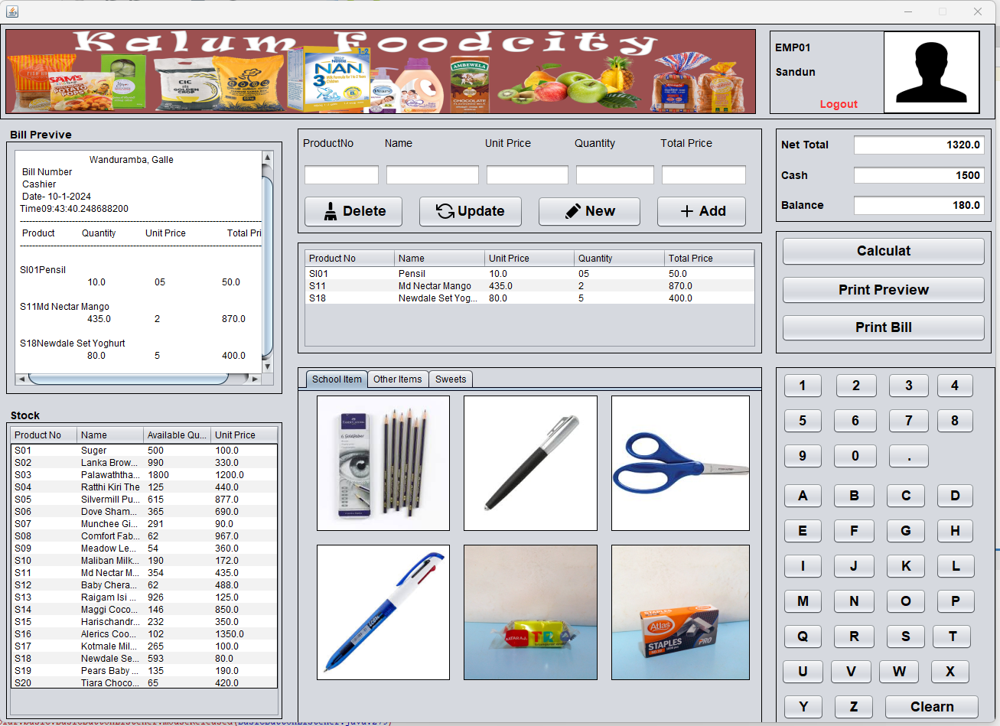
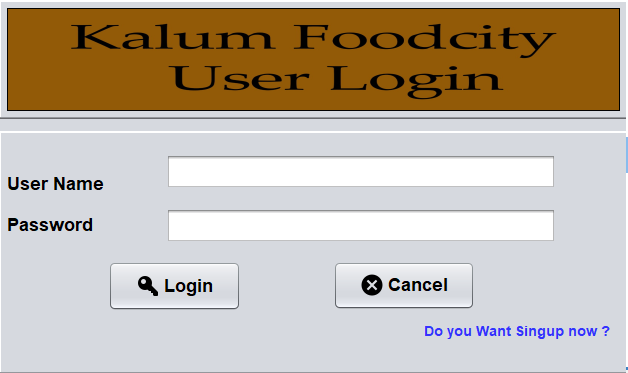
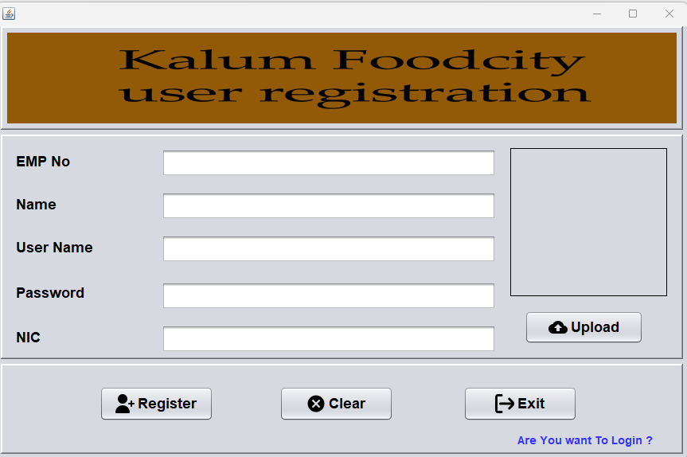

# Sales Management System

📌 **Overview**  
The **Sales Management System** is a Java-based application developed using **NetBeans IDE** and **MySQL**. It provides a secure and efficient way to manage product sales, billing, and transactions. The system includes user authentication, role-based access, a comprehensive dashboard, and image upload functionality. It is designed to streamline sales operations and enhance user productivity.

---

## 🚀 **Features**  
- **User Authentication**: Secure login and registration with validation.  
- **Role-Based Access**: Employees can log in to manage sales.  
- **Dashboard**: Displays stock availability, recent transactions, and quick action buttons.  
- **Image Upload**: Store user profile pictures in the database.  
- **Logout Functionality**: Securely exit the system.  

---

## 🛠️ **Technologies Used**  
- **Java (NetBeans IDE)**: For backend logic and GUI development.  
- **MySQL**: For database management.  
- **JDBC**: For database connectivity.  

---

## 🔧 **Core Functionalities**  
1. **Login & Registration Forms**:  
   - Users can register with a username, email, password, and profile image.  
   - Passwords are stored securely in the `users` table.  
   - Login validates credentials before granting access.  

2. **Dashboard**:  
   - Displays stock availability, recent transactions, and quick action buttons.  
   - Users can add products to the sales cart and process transactions.  
   - Includes a bill preview and printing option.  

3. **Logout Feature**:  
   - Users can securely log out and return to the login page.  

---

## 🖼️ **How to Upload Images**  
The system allows users to upload profile pictures during registration or profile updates. Here’s how it works:  
1. **Select Image**: Click the "Upload Image" button on the registration or profile update form.  
2. **Choose File**: Browse your device to select an image file (supported formats: JPG, PNG).  
3. **Save Image**: The selected image will be stored in the database and displayed on your profile.  

**Note**: Ensure the image size is within the allowed limit (e.g., 2MB) for optimal performance.  

---

## 📷 **Screenshots**  
Here are some screenshots of the application in action:  

| **Dashboard** | **Login Screen** | **Register Screen** |  
|---------------|------------------|---------------------|  
|  |  |  |  

---

## 🛠️ **Setup Instructions**  
1. **Prerequisites**:  
   - Install **Java Development Kit (JDK)**.  
   - Install **NetBeans IDE**.  
   - Install **MySQL** and set up a database.  

2. **Clone the Repository**:  
   ```bash
   git clone https://github.com/yourusername/sales-management-system.git
